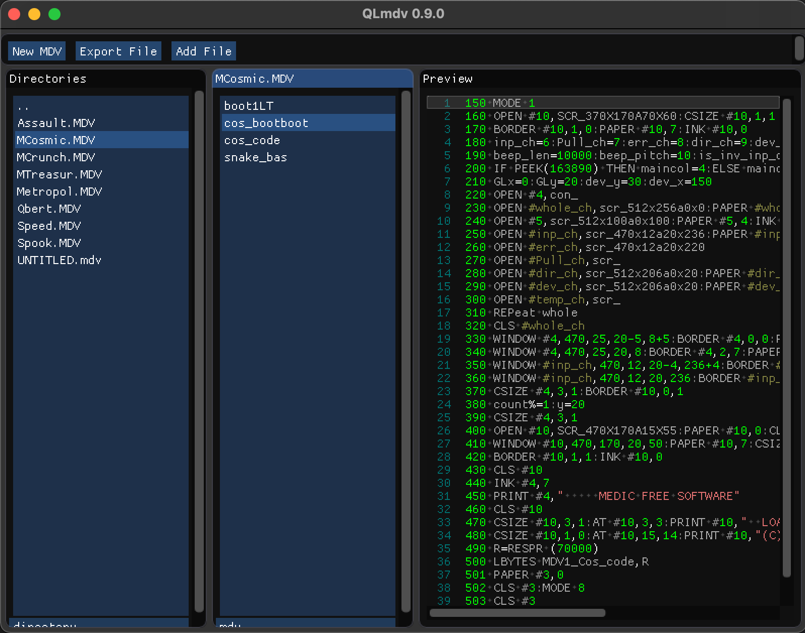

## QLmdv
#### Multiplatform-Frontend for the qlt tools



This is a quick and dirty hack (I made in a few hours) to simplify the usage of the qlt tools.
It allows to manage microdrive image files for the Sinclair QL in an easy way.
The qlt tools themselves are copyright by [Jan Venema](http://web.inter.nl.net/hcc/A.Jaw.Venema/) and created in 1990.
In the current stage I have just slightly changed the qlt c-functions itself, but will refactor them to C++ later.

- More infos at my [Project page on Classice Coder](http://classicscoder.com/projects.html)
- macOS only version [here](https://github.com/rogerboesch/qlmdv)

### How to build

```bash
git clone https://github.com/rogerboesch/qlmdv-multiplatform.git
cd qlmdv-multiplatform
mkdir build
cd build
```


**Build for Windows (Visual Studio Code)**

```bash
cmake ..
cmake --build . --config MinSizeRel
```


**Build for macOS (XCode)**

```bash
cmake -GXcode ..
```


**Build for Linux**

```bash
cmake -DCMAKE_BUILD_TYPE=MinSizeRel ..
cmake --build .
```
